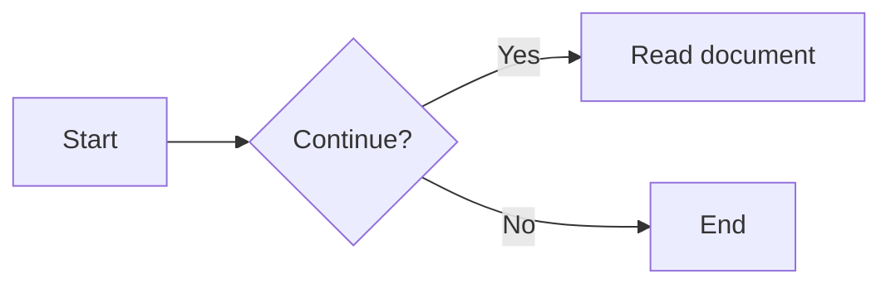

# MD Reader

A lightweight Markdown reader for Windows. Built with Tauri 2, React, and TypeScript, MD Reader focuses on reading local files, clean typography, and a distraction-free experience.


If you are looking for a simple, free Markdown reader focused on local files, give MD Reader a try. The project is currently maintained by the author as a personal, interest-driven project. Feature suggestions and feedback are welcome through the contact details at the end of this document.

> Current version: `0.1.5`

[简体中文](README.md)

## Contents

- [Features](#features)
- [Changelog](CHANGELOG.md)
- [Supported file types](#supported-file-types)
- [Markdown examples](#markdown-examples)
- [Keyboard shortcuts](#keyboard-shortcuts)
- [Download and installation](#download-and-installation)
- [Development environment](#development-environment)
- [Run locally](#run-locally)
- [Build the Windows installer](#build-the-windows-installer)
- [Project structure](#project-structure)
- [Security and privacy](#security-and-privacy)
- [Known limitations](#known-limitations)
- [Contributing](#contributing)
- [License](#license)
- [Acknowledgements](#acknowledgements)
- [Author and contact](#author-and-contact)

## Features

- **Local-first**: Open a single file with the system file picker, or recursively load a document folder.
- **Comfortable reading**: Switch between reading and source views, browse a document outline, track reading progress, choose from four themes, and adjust the font size.
- **Markdown extensions**: Supports GFM tables, task lists, strikethrough, footnotes, emoji, alert containers, subscript, superscript, math formulas, and syntax highlighting.
- **Chart previews**: Built-in ECharts and Mermaid previews. A failure in one chart does not affect the rest of the document.
- **Source editing**: Edit Markdown or text files in common encodings, save explicitly, and get notified about unsaved changes. The original encoding, BOM, and line-ending style are preserved when saving.
- **Reading state**: Scroll positions and recently opened files are remembered per file and restored after restarting the application.
- **Windows integration**: The installer registers Markdown and common text extensions, so MD Reader can be selected from the system's “Open with” menu.
- **Security boundaries**: Markdown HTML is sanitized. Chart dependencies are bundled locally; JavaScript in documents is not executed, and scripts are not loaded from a CDN.

## Supported file types

| Type | Extensions |
| --- | --- |
| Markdown | `.md`, `.markdown`, `.mdx`, `.mdown`, `.mkdn` |
| Plain text | `.txt`, `.text`, `.log`, `.rst` |

The application automatically detects common text encodings such as UTF-8, UTF-16, UTF-32, GBK, Big5, Shift-JIS, EUC-JP, EUC-KR, and Windows-1252. Individual files must be no larger than 25 MB. Files that cannot be reliably decoded or appear to be binary are skipped with a notification instead of silently overwriting the original content with replacement characters. When opening a folder, directories such as `.git`, `node_modules`, `target`, `dist`, `build`, `out`, and `.tools` are skipped.

## Markdown examples

### Math formulas

Inline formula: `$E=mc^2$`

Block formula:

```markdown
$$
\int_0^1 x^2 dx = \frac{1}{3}
$$
```

### Mermaid

````markdown

````

### ECharts

ECharts code blocks must contain strict JSON and use `echarts` as the language tag:

````markdown
```echarts
{
  "title": { "text": "Monthly reading volume" },
  "tooltip": { "trigger": "axis" },
  "xAxis": { "type": "category", "data": ["January", "February", "March"] },
  "yAxis": { "type": "value" },
  "series": [{ "type": "line", "smooth": true, "data": [120, 200, 150] }]
}
```
````

Charts do not support functions, variables, external data requests, or JavaScript object-literal extensions. Invalid configurations show an error message and the original code.

## Keyboard shortcuts

| Shortcut | Action |
| --- | --- |
| `Ctrl` + `O` | Open a file |
| `Ctrl` + `S` | Save current source changes |
| `Ctrl` + `F` | Find in source view |
| `Ctrl` + `+` / `Ctrl` + `=` | Increase font size |
| `Ctrl` + `-` | Decrease font size |
| `Tab` (source view) | Insert two spaces |

When switching files or folders, or closing the window, the application offers “Save / Don't save / Cancel” if the current document has unsaved changes. Before saving, it checks whether another program has modified the file to avoid silently overwriting external updates.

## Download and installation

Latest version (`0.1.5`): [Download the Windows x64 installer](./release/MD-Reader-latest-x64-setup.exe). Every successful build updates this fixed filename and adds a non-overwritable versioned archive named `MD-Reader-<version>-x64-setup.exe` in `release/`; earlier versioned archives are retained. After an official release, it will also be synchronized to GitHub Releases (or the release channel configured for the project).

The installer uses the Windows x64 NSIS format. Windows 11 usually includes WebView2. If WebView2 Runtime is not installed, install it first through an official Microsoft channel.

## Development environment

- Windows 10/11 x64
- Node.js 18 or later (the current LTS release is recommended)
- npm 11 (declared through `packageManager`)
- Rust stable toolchain
- WebView2 Runtime required by Tauri 2

Rust is not required for running only the frontend. Building or running the desktop application requires the complete Tauri toolchain.

## Run locally

After cloning the project, run the following from the repository root:

```powershell
npm install
npm run dev
```

`npm run dev` starts the Tauri desktop application and starts the Vite development server when needed. To run only the frontend development server in a browser:

```powershell
npm run dev:frontend
```

Common checks:

```powershell
npm run typecheck
npm run build:renderer
```

## Build the Windows installer

```powershell
npm run build
```

The `scripts/tauri-gnu.ps1` build script uses the LLVM-MinGW toolchain and Rust GNU target bundled in `.tools/llvm-mingw-20260826-ucrt-x86_64/` by default. Install the Rust target the first time you use it:

```powershell
rustup toolchain install stable-x86_64-pc-windows-gnu --profile minimal
```

The script configures the linker and related environment variables automatically, so installing Visual Studio with administrator privileges is not required. Alternatively, you can use Rust stable MSVC, Visual Studio 2022 Build Tools (select “Desktop development with C++”), and WebView2 Runtime instead of the bundled toolchain.

After a successful build, the latest installer is available at:

```text
release/MD-Reader-latest-x64-setup.exe
release/MD-Reader-<version>-x64-setup.exe
```

The original Tauri artifacts remain in:

```text
src-tauri/target/release/bundle/nsis/
```

## Project structure

```text
.
├─ src/                 # React UI, Markdown rendering, and preview logic
│  ├─ App.tsx           # Application state, file operations, and reader UI
│  ├─ markdown.ts       # Markdown-it, syntax highlighting, and HTML sanitization
│  ├─ previews.ts       # ECharts / Mermaid lifecycle and error fallback
│  └─ styles.css        # Reader styles and themes
├─ src-tauri/           # Tauri Rust backend, file access, and installer configuration
├─ scripts/             # Windows development/build scripts
├─ release/             # Latest Windows installer (fixed download path)
├─ docs/                # Feature requirements and design documents
├─ assets/              # Images used by the README and other documents
├─ index.html           # Vite entry point
├─ package.json         # Frontend dependencies and npm scripts
└─ vite.config.ts       # Vite configuration
```

## Security and privacy

- Documents are read only after the user explicitly authorizes “Open file” or “Open folder”; the backend validates the path, extension, file type, and size again.
- Local images can only be loaded from the current document directory. Markdown HTML and Mermaid SVG are sanitized with DOMPurify.
- ECharts accepts only JSON configuration and rejects external resource URLs. Mermaid runs with a strict security level.
- The application does not upload document content or request remote scripts/CDN resources while rendering. Links clicked by the user open in the system's default browser.
- Recently opened files, themes, font size, and scroll positions are stored in local browser storage. Recent history can be cleared in the application.

If you find a security issue, please do not disclose exploitation details in a public issue. Contact the project maintainer through the email address below first.

## Known limitations

- Only Windows x64 is currently supported; no macOS, Linux, or mobile build configuration is provided.
- Common text encodings are detected and converted to Unicode for reading and editing, then written back in the original encoding when saved. Files that cannot be reliably detected fail to open to avoid corrupting their encoding.
- Automatic save, Save As, new documents, collaborative editing, cloud synchronization, and a plugin marketplace are not provided.
- Chart and Mermaid state is not persisted across application restarts. Offline export to images or PDF is not currently promised.
- `ECharts` code blocks accept strict JSON only and never execute JavaScript.

## Contributing

Issues and pull requests are welcome. Before submitting, please:

1. Describe the reproduction steps, expected behavior, and actual behavior. Include a minimal Markdown example for rendering issues.
2. Update the related documentation or examples when changing UI or parsing behavior.
3. Run `npm run typecheck` and `npm run build:renderer` locally, then manually verify opening, editing, saving, and theme switching on Windows x64.
4. Do not commit `node_modules/`, build caches, personal documents, or files containing sensitive information.

See [`docs/功能需求说明.md`](docs/功能需求说明.md) for the feature scope and acceptance criteria.

## License

This project is licensed under the [MIT License](LICENSE). Unless otherwise stated, the project source code is distributed under the MIT License.

Project dependencies and their copyrights and licenses remain with their respective owners. See `package-lock.json`, `src-tauri/Cargo.lock`, and the license files bundled with dependencies. When distributing an installer, retain the licenses and copyright notices for third-party dependencies.

## Acknowledgements

This project is built on the following open-source projects:

- [Tauri](https://tauri.app/)
- [React](https://react.dev/)
- [Vite](https://vite.dev/)
- [Markdown-It](https://github.com/markdown-it/markdown-it)
- [highlight.js](https://highlightjs.org/)
- [KaTeX](https://katex.org/)
- [ECharts](https://echarts.apache.org/)
- [Mermaid](https://mermaid.js.org/)
- [DOMPurify](https://github.com/cure53/DOMPurify)

Refer to `package.json`, `package-lock.json`, and the Rust crate configuration for exact dependency versions and license information.

## Author and contact

- Author: 楚楠枫
- Email: <794165998@qq.com>

Feedback, feature suggestions, and discussions about the Markdown reader experience are welcome.
