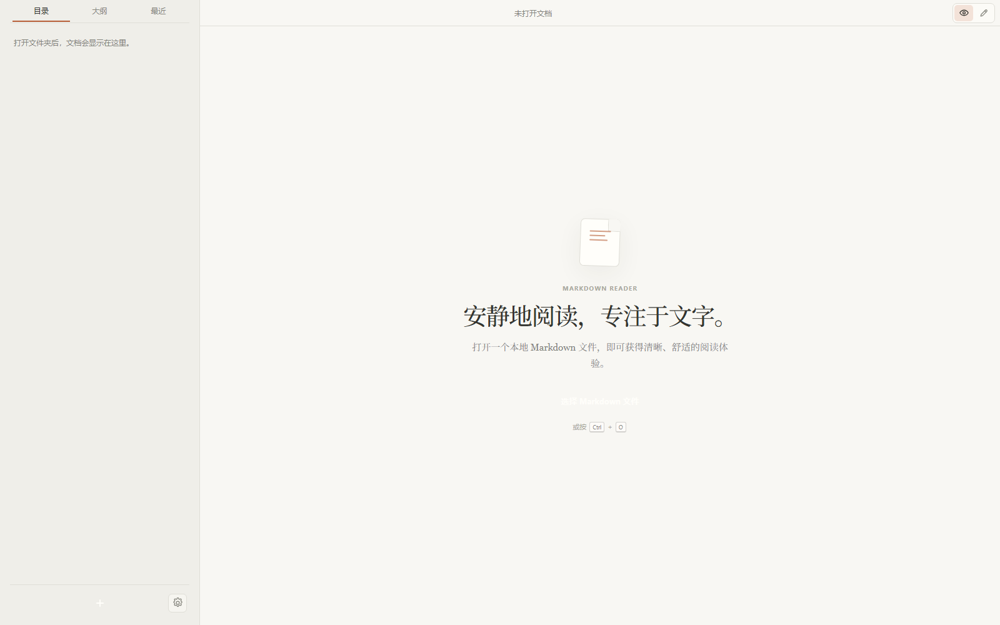
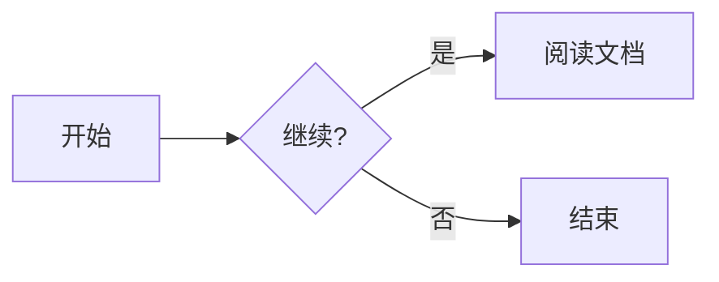

# MD Reader

[English](README.en.md)

一个面向 Windows 的轻量 Markdown 阅读器。MD Reader 使用 Tauri 2、React 和 TypeScript 构建，专注于本地文件阅读、清晰排版和低干扰体验。



如果你正在寻找一款简洁、免费、专注于本地文件的 Markdown 阅读器，欢迎试试 MD Reader。项目目前由作者个人维护，属于兴趣驱动开发；如果你有功能建议或使用反馈，欢迎通过文末联系方式与我交流。如果项目对你有帮助，也欢迎支持项目持续维护。

> 当前版本：`0.1.6`

## 目录

- [特性](#特性)
- [更新记录](CHANGELOG.md)
- [支持的文件类型](#支持的文件类型)
- [Markdown 示例](#markdown-示例)
- [快捷键](#快捷键)
- [下载与安装](#下载与安装)
- [开发环境](#开发环境)
- [本地运行](#本地运行)
- [构建 Windows 安装包](#构建-windows-安装包)
- [项目结构](#项目结构)
- [安全与隐私](#安全与隐私)
- [已知限制](#已知限制)
- [参与贡献](#参与贡献)
- [许可证](#许可证)
- [致谢](#致谢)
- [作者与联系](#作者与联系)
- [项目赞助](#项目赞助)

## 特性

- **本地优先**：通过系统文件选择器逐个打开文件，并以标签页在同一窗口中切换；目录侧栏会保留不同目录的项目，或递归加载一个文档目录。
- **舒适阅读**：阅读/源码视图切换、文档大纲、阅读进度、四种主题和可调字号。
- **Markdown 扩展**：支持 GFM 表格、任务列表、删除线、脚注、Emoji、提示容器、上下标、数学公式和代码语法高亮。
- **图表预览**：内置 ECharts 和 Mermaid 预览；单个图表解析失败不会影响其余文档内容。
- **源码编辑**：直接编辑常见编码的 Markdown 或文本文件，显式保存并提示未保存修改；保存时保留原编码、BOM 与换行风格。
- **阅读状态**：按文件记忆滚动位置和最近打开记录，重启应用后仍可恢复。
- **Windows 集成**：安装包注册 Markdown 和常见文本扩展名，可在系统“打开方式”中选择 MD Reader。
- **安全边界**：Markdown HTML 会经过净化；图表依赖随应用本地打包，不执行文档中的 JavaScript，也不从 CDN 加载脚本。

## 支持的文件类型

| 类型 | 扩展名 |
| --- | --- |
| Markdown | `.md`、`.markdown`、`.mdx`、`.mdown`、`.mkdn` |
| 纯文本 | `.txt`、`.text`、`.log`、`.rst` |

应用会自动识别 UTF-8、UTF-16、UTF-32、GBK、Big5、Shift-JIS、EUC-JP、EUC-KR 和 Windows-1252 等常见文本编码，单个文件大小不超过 25 MB。无法可靠识别或疑似二进制的文件会跳过并提示，不会以替换字符静默覆盖原文件。打开文件夹时会跳过 `.git`、`node_modules`、`target`、`dist`、`build`、`out` 和 `.tools` 等目录。

## Markdown 示例

### 数学公式

行内公式：`$E=mc^2$`

块级公式：

```markdown
$$
\int_0^1 x^2 dx = \frac{1}{3}
$$
```

### Mermaid

````markdown

````

### ECharts

ECharts 代码块必须使用严格 JSON，并将语言标记写成 `echarts`：

````markdown
```echarts
{
  "title": { "text": "月度阅读量" },
  "tooltip": { "trigger": "axis" },
  "xAxis": { "type": "category", "data": ["一月", "二月", "三月"] },
  "yAxis": { "type": "value" },
  "series": [{ "type": "line", "smooth": true, "data": [120, 200, 150] }]
}
```
````

图表不支持函数、变量、外部数据请求或 JavaScript 对象字面量扩展。无效配置会显示错误提示和原始代码。

## 快捷键

| 快捷键 | 操作 |
| --- | --- |
| `Ctrl` + `O` | 打开文件 |
| `Ctrl` + `S` | 保存当前源码修改 |
| `Ctrl` + `F` | 在源码视图中查找 |
| `Ctrl` + `+` / `Ctrl` + `=` | 增大字号 |
| `Ctrl` + `-` | 减小字号 |
| `Tab`（源码视图） | 插入两个空格 |

切换文件、文件夹或关闭窗口时，如果当前文档有未保存修改，应用会提供“保存 / 不保存 / 取消”选项。保存前会检查文件是否被其他程序修改，避免静默覆盖外部更新。

## 下载与安装

当前最新版（`0.1.6`）：[下载 Windows x64 安装包](./release/MD-Reader-latest-x64-setup.exe)。每次成功构建都会更新该固定文件名，同时在 `release/` 中新增不可覆盖的版本归档 `MD-Reader-<版本号>-x64-setup.exe`；之前的版本归档会保留。正式发布后也会同步到 GitHub Releases（或项目配置的发布渠道）。

安装包为 Windows x64 NSIS 格式。Windows 11 通常已内置 WebView2；如果系统没有 WebView2 Runtime，请先从 Microsoft 官方渠道安装。

## 开发环境

- Windows 10/11 x64
- Node.js 18 或更高版本（推荐使用当前 LTS）
- npm 11（项目通过 `packageManager` 声明）
- Rust stable 工具链
- Tauri 2 所需的 WebView2 Runtime

仅运行前端页面时不需要 Rust；构建或运行桌面应用时需要完整的 Tauri 工具链。

## 本地运行

克隆项目后，在项目根目录执行：

```powershell
npm install
npm run dev
```

`npm run dev` 会启动 Tauri 桌面应用，并在需要时启动 Vite 开发服务器。如果只想启动浏览器中的前端开发服务器：

```powershell
npm run dev:frontend
```

常用检查命令：

```powershell
npm run typecheck
npm run build:renderer
```

## 构建 Windows 安装包

```powershell
npm run build
```

构建脚本 `scripts/tauri-gnu.ps1` 默认使用项目内 `.tools/llvm-mingw-20260826-ucrt-x86_64/` 中的 LLVM-MinGW 和 Rust GNU 目标。首次使用时安装 Rust 目标：

```powershell
rustup toolchain install stable-x86_64-pc-windows-gnu --profile minimal
```

脚本会自动设置链接器和相关环境变量，不要求管理员权限安装 Visual Studio。若不使用项目内工具链，也可以改用 Rust stable MSVC、Visual Studio 2022 Build Tools（勾选“使用 C++ 的桌面开发”）以及 WebView2 Runtime。

成功构建后，推荐从以下位置获取最新版安装包：

```text
release/MD-Reader-latest-x64-setup.exe
release/MD-Reader-<版本号>-x64-setup.exe
```

Tauri 原始产物仍位于：

```text
src-tauri/target/release/bundle/nsis/
```

## 项目结构

```text
.
├─ src/                 # React 界面、Markdown 渲染和预览逻辑
│  ├─ App.tsx           # 应用状态、文件操作、阅读器界面
│  ├─ markdown.ts       # Markdown-it、代码高亮和 HTML 净化
│  ├─ previews.ts       # ECharts / Mermaid 生命周期和错误降级
│  └─ styles.css        # 阅读器样式与主题
├─ src-tauri/           # Tauri Rust 后端、文件访问和安装包配置
├─ scripts/             # Windows 开发/构建脚本
├─ release/             # 最新 Windows 安装包（固定下载路径）
├─ docs/                # 功能需求与设计文档
├─ assets/              # README 等文档使用的图片资源
├─ index.html           # Vite 入口
├─ package.json         # 前端依赖和 npm 脚本
└─ vite.config.ts       # Vite 配置
```

## 安全与隐私

- 文档只在用户通过“打开文件”或“打开文件夹”明确授权后读取；后端会再次校验路径、扩展名、文件类型和大小。
- 本地图片仅允许从当前文档目录加载，Markdown HTML 和 Mermaid SVG 会经过 DOMPurify 净化。
- ECharts 只接受 JSON 配置，并拒绝外部资源 URL；Mermaid 使用严格安全级别。
- 应用不会上传文档内容，也不会在渲染过程中请求远程脚本或 CDN 资源。用户点击网页链接时，链接会交由系统默认浏览器打开。
- 最近打开记录、主题、字号和滚动位置保存在本机浏览器存储中，可在应用内清空最近记录。

如果发现安全问题，请不要在公开 issue 中直接披露利用细节，建议先通过文末邮箱联系项目维护者。

## 已知限制

- 当前仅支持 Windows x64；暂不提供 macOS、Linux 或移动端构建配置。
- 自动识别常见文本编码并转换为 Unicode 供阅读和编辑；保存时按原编码写回。无法可靠识别的文件会以打开失败处理，避免误编码保存。
- 不提供自动保存、另存为、新建文档、协作编辑、云同步或插件市场。
- 图表和 Mermaid 状态不会跨应用重启持久化；当前也不承诺离线导出为图片或 PDF。
- `ECharts` 代码块只接受严格 JSON，不执行其中的 JavaScript。

## 参与贡献

欢迎提交 issue 和 pull request。建议在提交前：

1. 说明复现步骤、预期行为和实际行为；涉及渲染问题时附上最小 Markdown 示例。
2. 对界面或解析行为的改动，同时更新相关文档或示例。
3. 本地运行 `npm run typecheck` 和 `npm run build:renderer`，并在 Windows x64 上手动验证打开、编辑、保存和主题切换。
4. 不要提交 `node_modules/`、构建缓存、个人文档或包含敏感信息的文件。

功能范围和验收标准见 [`docs/功能需求说明.md`](docs/功能需求说明.md)。

## 许可证

本项目采用 [MIT License](LICENSE)。除非另有说明，项目源码均按 MIT 许可证授权。

项目依赖及其版权和许可证仍归各自权利人所有，详见 `package-lock.json`、`src-tauri/Cargo.lock` 及依赖包附带的许可证文件。发布安装包时请同时保留第三方依赖的许可证和版权声明。

## 致谢

项目基于以下开源项目构建：

- [Tauri](https://tauri.app/)
- [React](https://react.dev/)
- [Vite](https://vite.dev/)
- [Markdown-It](https://github.com/markdown-it/markdown-it)
- [highlight.js](https://highlightjs.org/)
- [KaTeX](https://katex.org/)
- [ECharts](https://echarts.apache.org/)
- [Mermaid](https://mermaid.js.org/)
- [DOMPurify](https://github.com/cure53/DOMPurify)

各依赖的具体版本和许可证信息以 `package.json`、`package-lock.json` 及 Rust crate 配置为准。

## 作者与联系

- 作者：楚楠枫
- 邮箱：<794165998@qq.com>

欢迎反馈问题、提出功能建议，或交流 Markdown 阅读器的使用体验。

## 项目赞助

如果 MD Reader 对你有所帮助，欢迎自愿赞助项目维护。二维码对应个人支付宝账户，收款人信息以支付宝扫码页面显示为准；赞助款主要用于项目开发、维护及相关开支。

- 赞助完全自愿，不影响软件的下载、使用、更新或参与社区交流。
- 本项目不以赞助换取特定功能、商品、服务或其他回报，也不承诺特定功能、版本、维护期限或技术支持；如需商业技术支持，请通过邮件另行确认服务内容和费用。
- 本页面提供的是项目赞助，不以慈善募捐名义开展活动；项目维护者不提供公益捐赠票据或税前扣除凭证。赞助款的税务处理以实际情况和主管税务机关意见为准。
- 付款前请核对支付宝收款人信息，并从本项目官方页面获取二维码。因冒用二维码、误付或支付平台处理产生的问题，请联系收款人或支付宝处理。
- 支付由支付宝完成，本项目不会要求你在应用内提供支付密码或其他支付凭据。

打开支付宝扫一扫即可：


